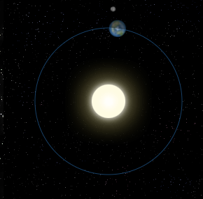

# Canvas API

Exemplo de uso da API de Canvas do HTML5. 

# Link de Exemplo

1. https://geraldomilholo.github.io/cefet-web-weblot/apis/canvas/

# Créditos

Este trabalho foi realizado em 2017/01 para a disciplina de Programação para Web do CEFET-MG no Campus II de Belo Horizonte.

Autor(es):

1. Geraldo Vinicius Costa Milholo
2. Vinicius Teodoro