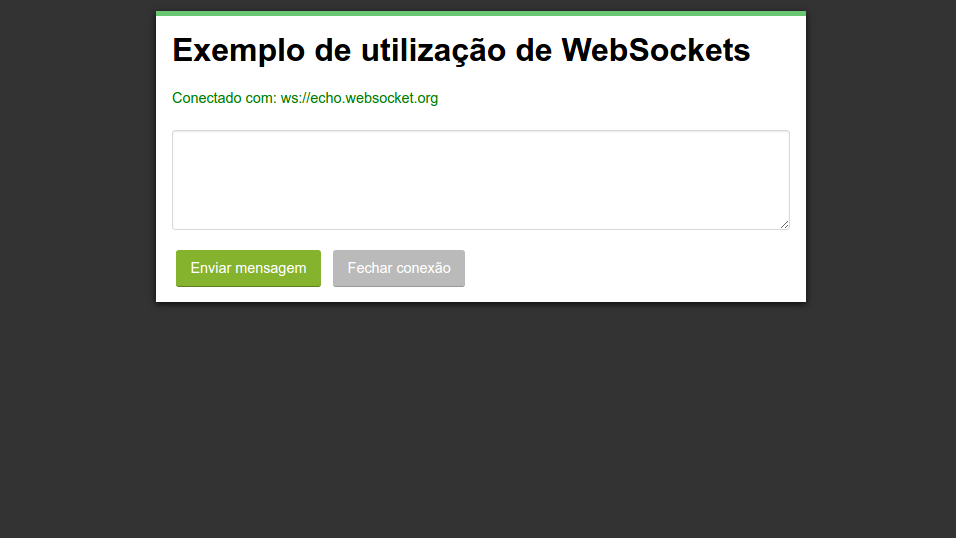

# _WebSocket_

Exemplo de uso da API de _WebSocket_ do HTML5.

## Links do Exemplo

- Link para seminário: [slides da apresentacao][slides]
- Link para exemplo publicado: [página no GitHub][vivo]

## Créditos

Este trabalho foi realizado em 2016/01 para a disciplina de Programação para Web do CEFET-MG no Campus II de Belo Horizonte.

Autor:

1. Rômulo Rocha Lemes (201112040455)

Atribuições:

- [websocket.org][websocket_link]
- [MDN WebSockets][mdn_link]

[slides]: http://slides.com/romulolemes/deck/fullscreen
[vivo]: https://github.com/romulolemes/cefet-web-weblot/tree/2016/01/apis/websocket/
[websocket_link]: http://www.websocket.org/
[mdn_link]: https://developer.mozilla.org/pt-BR/docs/WebSockets
